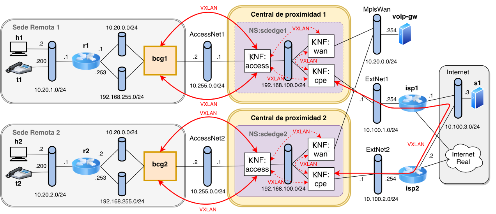

# Configuration guide

## Set-up VNX upm enviroment

    cd vnx
    ./init.sh
    vnx -f vnx/sdedge_nfv.xml -t

  You will see:
    
    Bridge MplsWan
        Port "voip-gw-e1"
            Interface "voip-gw-e1"
        Port MplsWan
            Interface MplsWan
                type: internal
    Bridge "ExtNet1"
        Port "ExtNet1"
            Interface "ExtNet1"
                type: internal       
        Port "isp1-e1"
            Interface "isp1-e1"
    Bridge Internet
        Port Internet
            Interface Internet
                type: internal
        Port "s1-e1"
            Interface "s1-e1"
        Port "isp2-e2"
            Interface "isp2-e2"
        Port "isp1-e2"
            Interface "isp1-e2"
    Bridge "AccessNet1"        
        Port "AccessNet1"
            Interface "AccessNet1"
                type: internal
        Port "bcg1-e3"
            Interface "bcg1-e3"
    Bridge "ExtNet2"
        Port "isp2-e1"
            Interface "isp2-e1"        
        Port "ExtNet2"
            Interface "ExtNet2"
                type: internal
    Bridge "AccessNet2"       
        Port "AccessNet2"
            Interface "AccessNet2"
                type: internal
        Port "bcg2-e3"
            Interface "bcg2-e3"
    ovs_version: "2.9.8"

## Network attachment definitions and upload OSM packages

See network attachment definition folder

Upload osm packages and instantiate ns in OSM web page:

    cd KNF

    osm vnfd-create accessknf
    osm vnfd-create accessknf2
    osm vnfd-create cpeknf
    osm vnfd-create cpeknf2
    osm vnfd-create wanknf
    osm vnfd-create wanknf2

    osm nsd-create nsred1
    osm nsd-create nsred2

## ACCESS KNF

Example creating vxlan tunnel:

        ovs-vsctl add-port brint axscpe -- set interface axscpe options:remote_ip=192.168.100.2 options:dst_port=8742 options:key=inet
     
**Bridges:**

    Bridge brint
        Port axscpe
            Interface axscpe
                type: vxlan
                options: {dst_port="8742", key=inet, remote_ip="192.168.100.2"}
        Port vxlan2
            Interface vxlan2
                type: vxlan
                options: {dst_port="8742", key=inet, remote_ip="10.255.0.2"}
        Port brint
            Interface brint
                type: internal
    Bridge brwan
        Port brwan
            Interface brwan
                type: internal
        Port vxlan1
            Interface vxlan1
                type: vxlan
                options: {remote_ip="10.255.0.2"}
        Port axswan
            Interface axswan
                type: vxlan
                options: {remote_ip="192.168.100.3"}
    ovs_version: "2.13.5"
    
**Routes:**

    10.255.0.0/24 dev net1 proto kernel scope link src 10.255.0.1 
    192.168.100.0/24 dev net2 proto kernel scope link src 192.168.100.1 

## CPE KNF

**Necessary packages:**

    apt-get install iptables    
    
**Bridges:**

    Bridge brwan
        Port vxlan1
            Interface vxlan1
                type: vxlan
                options: {remote_ip="10.100.2.1"}
        Port brwan
            Interface brwan
                type: internal
        Port cpewan
            Interface cpewan
                type: vxlan
                options: {dst_port="8741", key=sdwn, remote_ip="192.168.100.3"}
    Bridge brint
        Port axscpe
            Interface axscpe
                type: vxlan
                options: {dst_port="8742", key=inet, remote_ip="192.168.100.1"}
        Port brint
            Interface brint
                type: internal
    ovs_version: "2.13.5"

**Routes:**

    default via 10.100.1.254 dev net1 
    10.20.1.0/24 via 192.168.255.253 dev brint 
    10.100.1.0/24 dev net1 proto kernel scope link src 10.100.1.1 
    192.168.100.0/24 dev net2 proto kernel scope link src 192.168.100.2 
    192.168.255.0/24 dev brint proto kernel scope link src 192.168.255.254 

## WAN KNF

neccessary packages:

    apt-get install ryu-bin
    flowmanager
    
**Bridges:**

    Bridge brwan
        Controller "tcp:127.0.0.1:6633"
            is_connected: true
        fail_mode: secure
        Port cpewan
            Interface cpewan
                type: vxlan
                options: {dst_port="8741", key=sdwn, remote_ip="192.168.100.2"}
        Port brwan
            Interface brwan
                type: internal
        Port axswan
            Interface axswan
                type: vxlan
                options: {remote_ip="192.168.100.1"}
        Port net1
            Interface net1
    ovs_version: "2.13.5"

**Routes:**

    192.168.100.0/24 dev net2 proto kernel scope link src 192.168.100.3
    
**controller set-up:**

    OVS_DPID="0000000000000001"

    ryu-manager --verbose flowmanager/flowmanager.py ryu.app.ofctl_rest 2>&1 | tee ryu.log &

    service openvswitch-switch start
    ovs-vsctl add-br brwan
    ovs-vsctl set bridge brwan protocols=OpenFlow10,OpenFlow12,OpenFlow13
    ovs-vsctl set-fail-mode brwan secure
    ovs-vsctl set bridge brwan other-config:datapath-id=$OVS_DPID
    
    CONTROLLER_IP="127.0.0.1"
    CONTROLLER="tcp:$CONTROLLER_IP:6633"
    ovs-vsctl set-controller brwan $CONTROLLER

**flows:**

    wanknf@: ovs-vsctl -- --columns=name,ofport list Interface
     name                : cpewan
     ofport              : 3

     name                : brwan
     ofport              : 65534

     name                : net1
     ofport              : 2

     name                : axswan
     ofport              : 1
  
  JSON to apply:

    {"dpid": 1, "priority": 45001, "cookie": 202003, "match": {  "in_port": 1, "dl_dst": "00:00:00:00:00:20"}, "actions": [{"type":"OUTPUT", "port":2}]}
    {"dpid": 1, "priority": 45001, "cookie": 202002, "match": {  "in_port": 2, "dl_src": "00:00:00:00:00:20"}, "actions": [{"type":"OUTPUT", "port":1}]}
    {"dpid": 1, "priority": 45000, "cookie": 202001, "match": {  "in_port": 1, "dl_dst": "ff:ff:ff:ff:ff:ff"}, "actions": [{"type":"OUTPUT", "port":"FLOOD"}]}
    {"dpid": 1, "priority": 40000, "cookie": 2, "match": {"in_port": 3}, "actions": [{"type":"OUTPUT", "port":1}]}
    {"dpid": 1, "priority": 40000, "cookie": 1, "match": {"in_port": 1}, "actions": [{"type":"OUTPUT", "port":3}]}
    {"dpid": 1, "priority": 45002, "cookie": 202011, "match": {  "in_port": 1, "ipv4_dst": "10.20.2.192/26", "eth_type": 2048}, "actions": [{"type":"OUTPUT", "port":2}]}

   Result:
  
    wanknf@: ovs-ofctl dump-flows brwan
    
    cookie=0x3151b, duration=983.405s, table=0, n_packets=53, n_bytes=5194, priority=45002,ip,in_port=axswan,nw_dst=10.20.2.192/26 actions=output:net1
    cookie=0x31512, duration=983.552s, table=0, n_packets=0, n_bytes=0, priority=45001,in_port=net1,dl_src=00:00:00:00:00:20 actions=output:axswan
    cookie=0x31511, duration=983.651s, table=0, n_packets=13, n_bytes=546, priority=45000,in_port=axswan,dl_dst=ff:ff:ff:ff:ff:ff actions=FLOOD
    cookie=0x31513, duration=983.475s, table=0, n_packets=0, n_bytes=0, priority=45001,in_port=axswan,dl_dst=00:00:00:00:00:20 actions=output:net1
    cookie=0x1, duration=983.793s, table=0, n_packets=36, n_bytes=3024, priority=40000,in_port=axswan actions=output:cpewan
    cookie=0x2, duration=983.722s, table=0, n_packets=78, n_bytes=7140, priority=40000,in_port=cpewan actions=output:axswan

## ACCESS KNF 2

**Bridges:**

    Bridge brwan
        Port vxlan1
            Interface vxlan1
                type: vxlan
                options: {remote_ip="10.255.0.2"}
        Port axswan
            Interface axswan
                type: vxlan
                options: {remote_ip="192.168.200.3"}
        Port brwan
            Interface brwan
                type: internal
    Bridge brint
        Port axscpe
            Interface axscpe
                type: vxlan
                options: {dst_port="8742", key=inet, remote_ip="192.168.200.2"}
        Port vxlan2
            Interface vxlan2
                type: vxlan
                options: {dst_port="8742", key=inet, remote_ip="10.255.0.2"}
        Port brint
            Interface brint
                type: internal
    ovs_version: "2.13.5"

**Routes:**

    10.255.0.0/24 dev net1 proto kernel scope link src 10.255.0.1 
    192.168.200.0/24 dev net2 proto kernel scope link src 192.168.200.1 

## CPE KNF 2

**Necessary packages:**

    apt-get install iptables    
    
**Bridges:**

    Bridge brwan
        Port brwan
            Interface brwan
                type: internal
        Port cpewan
            Interface cpewan
                type: vxlan
                options: {dst_port="8741", key=sdwn, remote_ip="192.168.200.3"}
        Port vxlan1
            Interface vxlan1
                type: vxlan
                options: {remote_ip="10.100.1.1"}
    Bridge brint
        Port brint
            Interface brint
                type: internal
        Port axscpe
            Interface axscpe
                type: vxlan
                options: {dst_port="8742", key=inet, remote_ip="192.168.200.1"}

**Routes:**

    default via 10.100.2.254 dev net1 
    10.20.2.0/24 via 192.168.255.253 dev brint 
    10.100.2.0/24 dev net1 proto kernel scope link src 10.100.2.1  
    192.168.200.0/24 dev net2 proto kernel scope link src 192.168.200.2 
    192.168.255.0/24 dev brint proto kernel scope link src 192.168.255.254 

## WAN KNF 2

**Bridges:**

    Bridge brwan
        Controller "tcp:127.0.0.1:6633"
        fail_mode: secure
        Port axswan
            Interface axswan
                type: vxlan
                options: {remote_ip="192.168.200.1"}
        Port brwan
            Interface brwan
                type: internal
        Port cpewan
            Interface cpewan
                type: vxlan
                options: {dst_port="8741", key=sdwn, remote_ip="192.168.200.2"}
        Port net1
            Interface net1
    ovs_version: "2.13.5"
    
**Routes:**

    192.168.200.0/24 dev net2 proto kernel scope link src 192.168.200.3 
        
**controller set-up:**

    OVS_DPID="0000000000000002"

    ryu-manager --verbose flowmanager/flowmanager.py ryu.app.ofctl_rest 2>&1 | tee ryu.log &

    service openvswitch-switch start
    ovs-vsctl add-br brwan
    ovs-vsctl set bridge brwan protocols=OpenFlow10,OpenFlow12,OpenFlow13
    ovs-vsctl set-fail-mode brwan secure
    ovs-vsctl set bridge brwan other-config:datapath-id=$OVS_DPID
    
        
    CONTROLLER_IP="127.0.0.1"
    CONTROLLER="tcp:$CONTROLLER_IP:6633"
    ovs-vsctl set-controller brwan $CONTROLLER
    
**flows:**

    wanknf@: ovs-vsctl -- --columns=name,ofport list Interface
     name                : cpewan
     ofport              : 2

     name                : brwan
     ofport              : 65534

     name                : net1
     ofport              : 3

     name                : axswan
     ofport              : 1
  
  JSON to apply:

    {"dpid": 1, "priority": 45001, "cookie": 202003, "match": {  "in_port": 1, "dl_dst": "00:00:00:00:00:20"}, "actions": [{"type":"OUTPUT", "port":3}]}
    {"dpid": 1, "priority": 45001, "cookie": 202002, "match": {  "in_port": 3, "dl_src": "00:00:00:00:00:20"}, "actions": [{"type":"OUTPUT", "port":1}]}
    {"dpid": 1, "priority": 45000, "cookie": 202001, "match": {  "in_port": 1, "dl_dst": "ff:ff:ff:ff:ff:ff"}, "actions": [{"type":"OUTPUT", "port":"FLOOD"}]}
    {"dpid": 1, "priority": 40000, "cookie": 2, "match": {"in_port": 2}, "actions": [{"type":"OUTPUT", "port":1}]}
    {"dpid": 1, "priority": 40000, "cookie": 1, "match": {"in_port": 1}, "actions": [{"type":"OUTPUT", "port":2}]}
    {"dpid": 1, "priority": 45002, "cookie": 202011, "match": {  "in_port": 1, "ipv4_dst": "10.20.1.192/26", "eth_type": 2048}, "actions": [{"type":"OUTPUT", "port":3}]}
